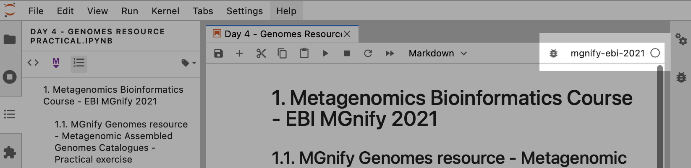

# EBI / SymbNET: from metagenomics to metabolic interactions - 2022

For full course information, see: [the course website](https://www.ebi.ac.uk/training/events/symbnet-2022/).

Learn about the tools, processes and analysis approaches used in the field of metagenomics.

## Preparing the interactive notebooks

We will have to install the dependencies to run the notebooks. To do so, we will use [miniconda](https://docs.conda.io/en/latest/miniconda.html).

Open a Terminal.

```shell
(base) conda create -n mgnify-ebi-2022 python=3.9
(base) conda activate mgnify-ebi-2022

(mgnify-ebi-2022) pip install -r requirements.txt
(mgnify-ebi-2022) ipython kernel install --name "mgnify-ebi-2022" --user
(mgnify-ebi-2022) jupyter-lab course.jupyterlab-workspace
```

Jupyter should be using the "mgnify-ebi-2022" kernel, so that the packages are available.
To check, look at the top right of the Jupyter Lab window:

