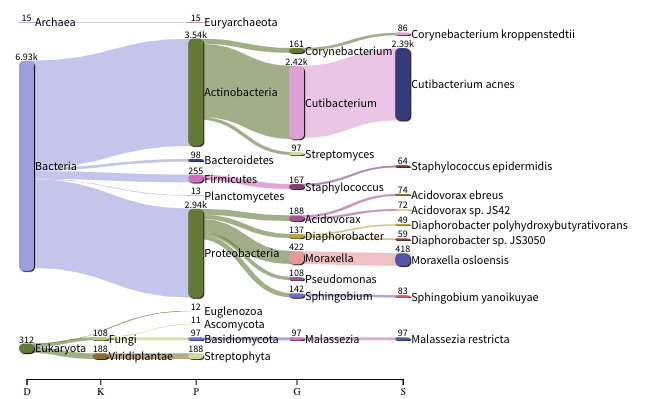
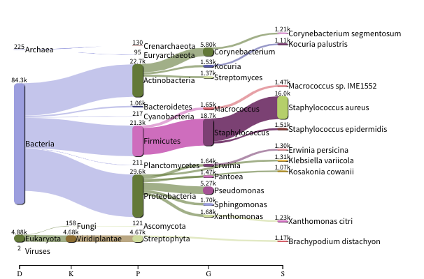

*******************************************************
Quality control and filtering of the raw sequence files
*******************************************************

Prerequisites
---------------

For this tutorial you will need to move into the working directory. All the required files should be here, or can be
downloaded using the tarball from http://ftp.ebi.ac.uk/pub/databases/metagenomics/mgnify_courses/ebi_2020/

.. code-block:: bash

    cd /home/training/Data/Quality/files
    chmod -R 777 /home/training/Data/Quality
    export DATADIR=/home/training/Data/Quality/files
    xhost +

Finally, start the docker container in the following way:

.. code-block:: bash

   docker run --rm -it  -e DISPLAY=$DISPLAY  -v $DATADIR:/opt/data -v /tmp/.X11-unix:/tmp/.X11-unix:rw -e DISPLAY=unix$DISPLAY microbiomeinformatics/mgnify-ebi-2020-qc-asssembly

.. note::
   It's possible that the docker image is not available in dockerhub.
   In that case you can build the container using the `Dockerfile <https://github.com/EBI-Metagenomics/mgnify-ebi-2020/blob/master/docs/source/data/qc-assembly/Dockerfile>`_
   
   To build the container, download the Dockerfile and run "docker build -t microbiomeinformatics/mgnify-ebi-2020-qc-asssembly ." in the folder that contains the Dockerfile.

Quality control and filtering of the raw sequence files
-----------------------------------------------------------------

|image1|\ Learning Objectives - in the following exercises you will learn
how to check on the quality of short read sequences: identify the
presence of adaptor sequences, remove both adaptors and low quality
sequences. You will also learn how to construct a reference database for
host decontamination. 

|image2|\  First go to your working area, the data that you downloaded
has been mounted in ``/opt/data`` in the docker container.

.. code-block:: bash

   cd /opt/data
   ls

|image1|\  Here you should see the same contents as you had in the working directory.
As we write into this directory, we should be able to see this from inside the container, and
on the filesystem of the computer running this container. We will use
this to our advantage as we go through this practical. Unless stated
otherwise all of the following commands should be executed in the
terminal running the Docker container.

|image2|\  Generate a directory of the fastqc results

.. code-block:: bash

    cd /opt/data
    mkdir fastqc_results
    fastqc oral_human_example_1_splitaa.fastq.gz
    fastqc oral_human_example_2_splitaa.fastq.gz
    mv /opt/data/*.zip /opt/data/fastqc_results
    mv /opt/data/*.html /opt/data/fastqc_results

|image2|\  Now on your **local** computer, go to the browser, and
``File -> Open File``. Use the file navigator to select the following file

    /home/training/Data/Quality/files/fastqc_results/oral_human_example_1_splitaa_fastqc.html

|image4|\

Spend some time looking at the 'Per base sequence quality’. 

|image1|\  For each position a BoxWhisker type plot is drawn. The
elements of the plot are as follows:

-  The central red line is the median value

-  The yellow box represents the inter-quartile range (25-75%)

-  The upper and lower whiskers represent the 10% and 90% points

-  The blue line represents the mean quality

The y-axis on the graph shows the quality scores. The higher the score
the better the base call. The background of the graph divides the y axis
into very good quality calls (green), calls of reasonable quality
(orange), and calls of poor quality (red). The quality of calls on most
platforms will degrade as the run progresses, so it is common to see
base calls falling into the orange area towards the end of a read.

|image3|\  What does this tell you about your sequence data? When do the
errors start? 

In the pre-processed files we see two warnings, as shown on the left
side of the report. Navigate to the “Per bases sequence content"

|image5|\ 

|image3|\ At around 15-19 nucleotides, the DNA composition becomes
very even, however, a the 5’ end of the sequence there  are distinct
differences. Why do you think that is?

|image2|\ Open up the FastQC report corresponding to the reversed
reads. 

|image3|\  Are there any significant differences between to the forward
and reverse files?

For more information on the FastQC report, please consult the
‘Documentation’ available from this
site: https://www.bioinformatics.babraham.ac.uk/projects/fastqc/

|image2|\ We are currently only looking at two files but often we want
to look at many files. The tool multiqc aggregates the FastQC results
across many samples and creates a single report for easy comparison.
Here we will demonstrate the use of this tool

.. code-block:: bash

    cd /opt/data
    mkdir multiqc_results
    multiqc fastqc_results -o multiqc_results

In this case, we provide the folder containing the fastqc results to
multiqc and the -o allows us to set the output directory for this
summarised report.

|image2|\  Now on your **local** computer, open the summary report from
MultiQC. To do so, go to your browser, and use ``File -> Open File``. Use the
file navigator to select the following file

  /home/training/Data/Quality/files/multiqc_results/multiqc_report.html

|image6|\

|image2|\  Scroll down through the report. The sequence quality
histograms show the following results from each file as two separate
lines. The 'Status Checks’ show a matrix of which samples passed check
and which ones have problems. 

|image3|\ What fraction of reads are duplicates? 

|image1|\  So, far we have looked at the raw files and assessed their
content, but we have not done anything about removing duplicates,
sequences with low quality scores or removal of the adaptors. So, lets
start this process. The first step in the process is to make a database
relevant for decontaminating the sample. It is always good to routinely
screen for human DNA (which may come from the host and/or staff
performing the experiment). However, if the sample is say from mouse,
you would want to download the the mouse genome. 

|image2|\  In the following exercise, we are going to use two “genomes”
already downloaded for you in the decontamination folder. To make this
tutorial quicker and smaller in terms of file sizes, we are going to use
PhiX (a common spike in) and just chromosome 10 from human.  

.. code-block:: bash

    cd /opt/data/decontamination

For the next step we need one file, so we want to merge the two
different fasta files. This is simply done using the command line tool
cat.

.. code-block:: bash

    cat phix.fasta GRCh38_chr10.fasta > GRCh38_phix.fasta

Now we need to build a bowtie index for them:

.. code-block:: bash

    bowtie2-build GRCh38_phix.fasta GRCh38_phix.index

|image1|\  It is possible to automatically download a pre-indexed human
genome in Bowtie2 format using the following command (but do not do this
now, as this will take a while to download):

    +----------------------------------------------------------------------+
    | kneaddata_database --download human_genome bowtie2                   |
    +----------------------------------------------------------------------+

|image2|\  Now we are going to use the `GRCh38_phix` database and clean-up
our raw sequences. kneaddata is a helpful wrapper script for a number
of pre-processing tools, including Bowtie2 to screen out contaminant
sequences, and Trimmomatic to exclude low-quality sequences. We also
have written wrapper scripts to run these tools (see below), but using
kneaddata allows for more flexibility in options.

.. code-block:: bash

    cd /opt/data/
    mkdir clean

We now need to uncompress the fastq files. 

.. code-block:: bash

    gunzip -c oral_human_example_2_splitaa.fastq.gz > oral_human_example_2_splitaa.fastq
    gunzip -c oral_human_example_1_splitaa.fastq.gz > oral_human_example_1_splitaa.fastq
    
    kneaddata --remove-intermediate-output -t 2 --input oral_human_example_1_splitaa.fastq --input oral_human_example_2_splitaa.fastq --output /opt/data/clean --reference-db /opt/data/decontamination/GRCh38_phix.index --bowtie2-options "--very-sensitive --dovetail" --trimmomatic-options "SLIDINGWINDOW:4:20 MINLEN:50"

|image1|\ The options above are:

    +---------------------------------------------------------------------------------------------+
    |                                                                                             |
    | \* **--input**, Input FASTQ file. This option is given twice as we have paired-end data.    |
    |                                                                                             |
    | \* **--output**, Output directory.                                                          |
    |                                                                                             |
    | \* **--reference-db**, Path to bowtie2 database for decontamination.                        |
    |                                                                                             |
    | \* **-t**, # Number of threads to use (2 in this case).                                     |
    |                                                                                             |
    | \* **--trimmomatic-options**, Options for Trimmomatic to use, in quotations                 |
    | ("SLIDINGWINDOW:4:20 MINLEN:50" in this case). See the Trimmomatic                          |
    | website for more options.                                                                   |
    |                                                                                             |
    | \* **--bowtie2-options**, Options for bowtie2 to use, in quotations. The                    |
    | options "--very-sensitive" and "--dovetail" set the alignment parameters                    |
    | to be very sensitive and sets cases where mates extend past each other                      |
    | to be concordant (i.e. they will be called as contaminants and be                           |
    | excluded).                                                                                  |
    |                                                                                             |
    | \* **--remove-intermediate-output**, Intermediate files, including large                    |
    | FASTQs, will be removed.                                                                    |
    |                                                                                             |
    +---------------------------------------------------------------------------------------------+

**Kneaddata generates multiple outputs in the “clean” directory,
containing different 4 different files for each read.**

|image2|\ Using what you have learned previously, generate a fastqc
report for each of the `oral_human_example_1_splitaa_kneaddata_paired`
files.  Do this within the clean directory.

.. code-block:: bash

    cd /opt/data/clean
    mkdir fastqc_final
    <you construct the commands>
    mv /opt/data/clean/*.zip /opt/data/clean/fastqc_final
    mv /opt/data/clean/*.html /opt/data/clean/fastqc_final

|image2|\  Also generate a multiqc report and look at the sequence
quality historgrams. 

.. code-block:: bash

    cd /opt/data/clean
    mkdir multiqc_final
    <you construct the command>

|image2|\  View the multiQC report as before using your browser. You
should see something like this:

|image7|\

|image3|\  Open the previous MultiQC report and see if they have
improved? 

|image3|\  Did sequences at the 5’ end become uniform? Why might that
be? Is there anything that suggests that adaptor sequences were found? 

|image2|\  To generate a summary file of how the sequence were
categorised by Kneaddata, run the following command.  

.. code-block:: bash

    cd /opt/data
    kneaddata_read_count_table --input /opt/data/clean --output kneaddata_read_counts.txt
    less kneaddata_read_counts.txt

|image3|\  What fraction of reads have been deemed to be contaminating?

|image1|\ The reads have now be decontaminated any can be uploaded to
ENA, one of the INSDC members. It is beyond the scope of this course to
include a tutorial on how to submit to ENA, but there is additional
information available on how to do this in this Online Training guide
provided by EMBL-EBI

https://www.ebi.ac.uk/training/online/course/ebi-metagenomics-portal-submitting-metagenomics-da/considerations-submitting-metagenomic-data

Assembly PhiX decontamination
------------------------------

|image1|\ Learning Objectives - in the following exercises you will generate a PhiX blast database, and
run a blast search with a subset of assembled freshwater sediment metagenomic reads, to identify contamination.

PhiX, used in the previous section of this practical, is a small bacteriophage genome typically used as a
calibration control in sequencing runs. Most library preparations will use PhiX at low concentrations, however it can
still appear in the sequencing run. If not filtered out, PhiX can form small spurious contigs which could
be incorrectly classified as diversity.

|image2|\  Generate the PhiX reference blast database

.. code-block:: bash

    cd /opt/data/decontamination
    makeblastdb -in phix.fasta -input_type fasta -dbtype nucl -parse_seqids -out phix_blastDB

|image2|\  Prepare the freshwater sediment example assembly file and search against the new blast database.
This assembly file contains only a subset of the contigs for the purpose of this practical.

.. code-block:: bash

    cd /opt/data
    gunzip -c freshwater_sediment_contigs.fa.gz > freshwater_sediment_contigs.fa
    blastn -query freshwater_sediment_contigs.fa -db decontamination/phix_blastDB -task megablast -word_size 28 -best_hit_overhang 0.1 -best_hit_score_edge 0.1 -dust yes -evalue 0.0001 -min_raw_gapped_score 100 -penalty -5 -soft_masking true -window_size 100 -outfmt 6 -out freshwater_blast_out.txt

|image1|\ The blast options are:

    +---------------------------------------------------------------------------------------------+
    |                                                                                             |
    | \* **-query**, Input assembly fasta filee.                                                  |
    |                                                                                             |
    | \* **-out**, Output file                                                                    |
    |                                                                                             |
    | \* **-db**, Path to blast database.                                                         |
    |                                                                                             |
    | \* **-task**, Search type -“megablast”, for very similar sequences (e.g, sequencing errors) |
    |                                                                                             |
    | \* **-word_size**, Length of initial exact match                                            |
    |                                                                                             |
    |                                                                                             |
    |                                                                                             |
    +---------------------------------------------------------------------------------------------+

|image2|\ Add headers to the blast output and look at the contents of the final output file

.. code-block:: bash

    cat blast_outfmt6.txt freshwater_blast_out.txt > freshwater_blast_out_headers.txt
    less freshwater_blast_out_headers.txt

|image3|\ Are the hits significant?

|image3|\ What are the lengths of the matching contigs? We would typically filter
metagenomic contigs at a length of 500bp. Would any PhiX contamination remain even after this filter?

|image1|\ Now that PhiX contamination was identified, it is important to remove these contigs from the assembly file
before further analysis or upload to public archives.

Using Negative Controls
-----------------------

|image1|\ Learning Objectives - This exercise will look at the analysis of negative controls. You will assess the
microbial diversity between a negative control and skin sample.

The images below show the taxonomic classification of two samples: a reagent negative control and a skin metagenomic
sample. The skin sample is taken from the antecubital fossa - the elbow crease, which is moist and site of
high microbial diversity. The classification was performed with kraken2. Kraken2 takes a while to run, so we have done this for you
and plotted the results. An example of the command used to do this:

    +--------------------------------------------------------------------------------------------------------------------------------------------------+
    |kraken2 --db standard_db --threshold 0.10 --threads 8 --use-names --fastq-input --report out.report --gzip-compressed in_1.fastq.gz in_2.fastq.gz |
    +--------------------------------------------------------------------------------------------------------------------------------------------------+

See the kraken2 manual for more information: https://github.com/DerrickWood/kraken2/wiki/Manual

See Pavian manual for the plots: https://ccb.jhu.edu/software/pavian/

|image1|\ The following image shows the microbial abundance in the negative control

|image10|\

|image1|\ The following image shows the microbial abundance in the skin sample

|image11|\

|image2|\ Look for similarities and differences at both the phylum and genus level - labelled as 'P' and 'G' on the
bottom axis.

|image3|\
Is there any overlap between the negative control and skin sample phylum?
Can we map the negative control directly to the skin sample to remove all contaminants? If not, why?

|image3|\
Are there any genera in the negative control which aren't present in the skin sample?
If you do a google search of this genus, where are they commonly found?
With this information, where could this bacteria in the negative control have originated from?

|image1|\ For more practice assessing and trimming datasets,
there is another set of raw reads called "skin_example_aa" from the skin metagenome available.
These will require a fastqc or multiqc report, followed by trimming and mapping to the reference database with kneaddata.
Using what you have learned previously, construct the relevant commands. Remember to check the quality before and after trimming.

Hint: Consider other trimmomatic options from the manual
http://www.usadellab.org/cms/uploads/supplementary/Trimmomatic/TrimmomaticManual_V0.32.pdf
e.g. "ILLUMINACLIP", where /opt/data/NexteraPE-PE is a file of adapters.

|image2|\ Navigate to skin folder and run quality control

.. code-block:: bash

    cd /opt/data/skin
    <construct the required commands>

.. |image1| image:: media/info.png
   :width: 0.26667in
   :height: 0.26667in
.. |image2| image:: media/action.png
   :width: 0.26667in
   :height: 0.26667in
.. |image3| image:: media/question.png
   :width: 0.26667in
   :height: 0.26667in
.. |image4| image:: media/fastqc1.png
   :width: 6.26389in
   :height: 4.30833in
.. |image5| image:: media/fastqc2.png
   :width: 6.26389in
   :height: 4.30833in
.. |image6| image:: media/multiqc1.png
   :width: 6.26389in
   :height: 4.30833in
.. |image7| image:: media/multiqc2.png
   :width: 6.26389in
   :height: 4.30833in
.. |image8| image:: media/blast.png
   :width: 6.26389in
   :height: 3.86181in
.. |image9| image:: media/bandage.png
   :width: 6.26389in
   :height: 3.67569in

