.. include:: ../partials/substitutions.rst

MGnify hands-on exercises solutions
###################################

For this session we will look at some of the data and analyses that are available from MGnify. We will navigate the resource, try out different ways to search for interesting samples/studies, and then investigate the analysis results that are available.

Browsing MGnify
****************

From the MGnify front page (https://www.ebi.ac.uk/metagenomics/) you can see various options to browse the data. There are quick links to the various data-types (e.g. amplicon, assembly, metagenomes, etc) we support, as well as a subset of the biomes that the data covers.

|action| Click on the "wastewater" biome icon.

|question| How many studies does MGnify hold that relate to wastewater?

There are 176 studies (as of Nov / 2021).

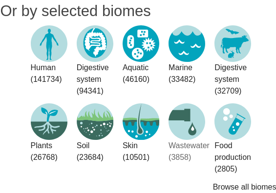
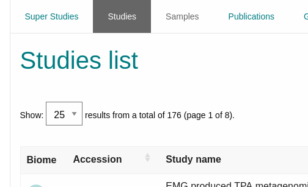

|question| How many samples does that relate to?

It related to XX samples 3858 (as of Nov / 2021).

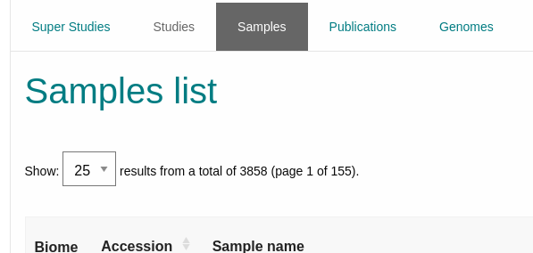

|action| From the sample list, filter for sample "ERS1215575", select it and take a look at the metadata available.

Use the filter table functionaly to find the sample

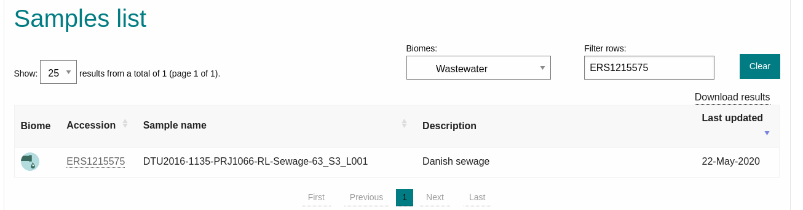

|question| Do you know the exact location of where the sample was taken?

You can explore the "Sample metadata" sectio to find that information:

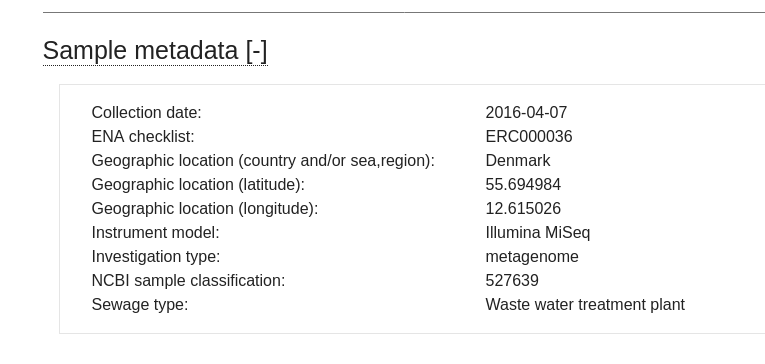

|question| What are the lat/long co-ordinates?

latitude: 55.6 ; longitude: 12.6

|question| Follow the link to the BioSamples record, can you find any more information about the location of the sample?

You can find the link to BioSamples in the "External links section".

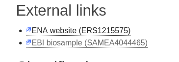

BioSamples will provide more information about the sample (https://www.ebi.ac.uk/biosamples/samples/SAMEA4044465)

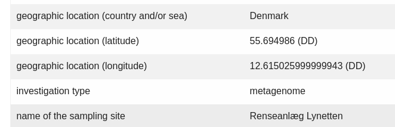

|action| From the tabs in the header bar, select **Text search**, and then select **Samples** below the search box. There are a number of metadata fields available to allow you to filter for a sample of interest to you. Not all are relevant to all samples. 
Within the hierarchy of biomes, navigate to environmental>aquatic>lentic. You should see 92 samples. Now select the depth filter.

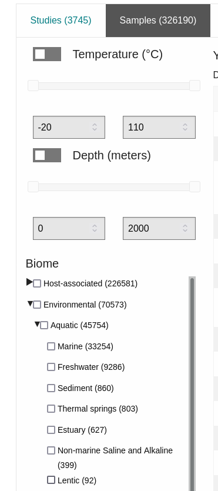

|question| How many lentic samples have depth data associated with them?

Therea are 50 lentic samples with depth data associated

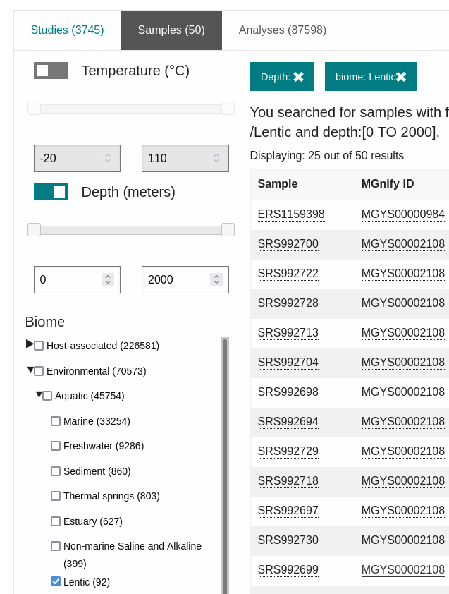

|question| Using the sliders, can you identify a sample of a lentic water system from a depth between 25-50m?

There are 17 samples that meet that criteria.

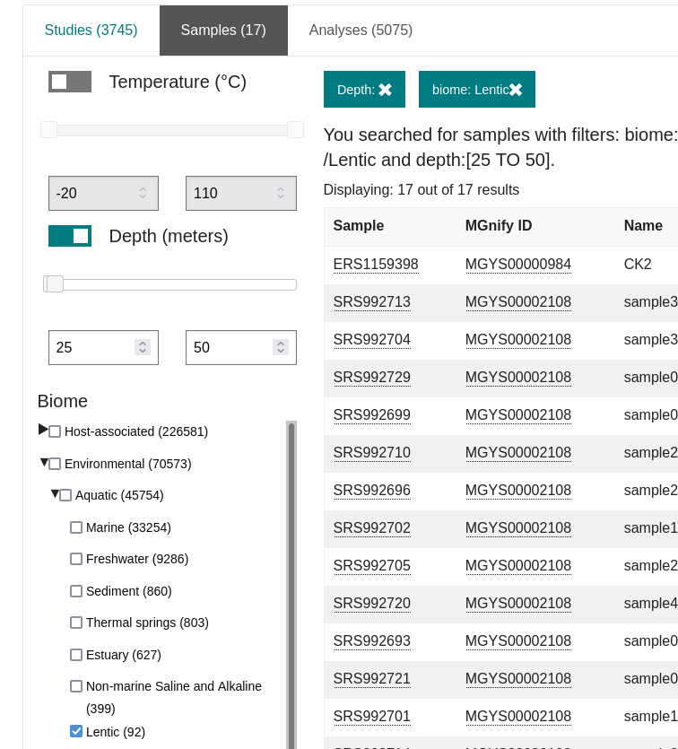

MGnify assembly analysis
**************************

Now we will look at some assembly data that has been analysed by MGnify. 

|action| Search for **MGYS00003598**, and go to this study page. This is a large study where MGnify have assembled the raw reads from an existing public study. The list of assemblies is shown at the bottom of the study page.

|question| How many assemblies are included in this study?

Study url: https://www.ebi.ac.uk/metagenomics/studies/MGYS00003598

It has 188 analyses.

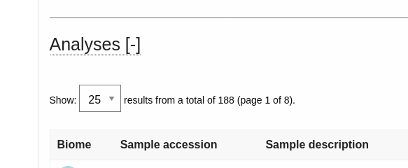

|action| Now, search for the analysis **MGYA00510849**. You can use the text search to find this accession. Have a look at the information within the **Quality control** tab.

The analysis url: https://www.ebi.ac.uk/metagenomics/analyses/MGYA00510849#overview

|question| How many contigs are included in this analysis?

You can obtain that information from the QC tab, in this case 5022.

.. image:: q6.png

|question| What length is the longest contig in this dataset?

You can obtain that information from the QC tab, the longest contig is 514.196 nt.

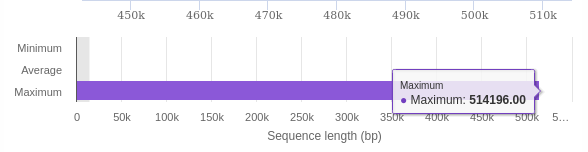

|action| Click on the **Taxonomic analysis** tab and examine the phylum composition in the graphs and the krona plot.

|question| What proportion of the total LSU rRNA predictions are eukaryotic? 

The pie chart provides that information, you can also get the answer from the krona plot.

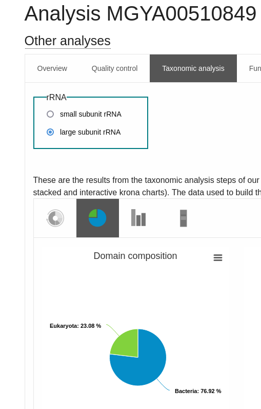

|question| What proportion of the bacterial predictions are proteobacteria?

I'll leave this one to you :).

|action| Click on the **Functional analysis** tab. The top part of this page shows a sequence feature summary, showing the number of contigs with predicted coding sequences (pCDS), the number of pCDS with InterPro matches, etc.

|question| How many predicted coding sequences (pCDS) are in the assembly? 

The "Functional analysis" tab provides a "Sequence feature summary" with that information

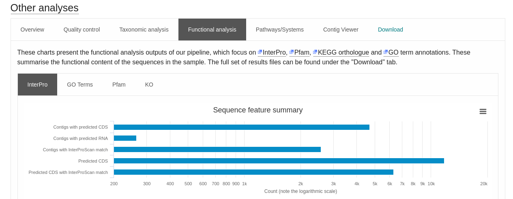

|question| How many pCDS have InterProScan hits? 

That information is on the "Sequence feature summary", there are 2576 pCDS with InterProScan.

|action| Scroll down the page to the InterPro match summary section.

|question| How many different InterPro entries are matched by the pCDS?

You can obtain that information from the "InterPro match summary"

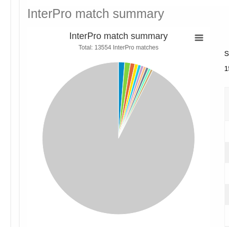

There are 13554 InterPro matches.

|question| Why is this figure different to the number of pCDS that have InterProScan hits? 

The summary shows the number of different InterPro entries that have a match by at least one pCDS. Each InterPro accession may be matched by different pCDS, for example the "Winged helix-like DNA-binding domain superfamily" has 178 pCDS matches. The total of "pCDS matched" for the table is 13554. So, for this analysis, 6314 pCDS match 13554 InterPro entries.

|action| Click on the **GO Terms** sub-tab. This shows a summary of the most common GO terms annotated to the pCDS as both bar charts, and pie charts.

|question| What are the top 3 biological process terms predicted for the pCDS from this assembly?

The GO Terms sub-tab provides a pie chart to make it easy to get an overview of the results.

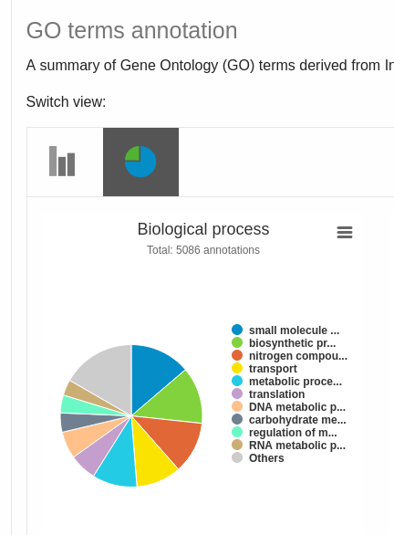

For this analysis the top 3 biological process are:
- Others
- "small molecule metabolic process"
- "biosynthetic processes" 

|action| Have a look at the information in the **Pfam** and **KO** (KEGG orthologue) sub-tabs.

|action| Click on the **Pathways/Systems** tab. Have a look at the data reported in the 3 sub-tabs: KEGG Module, Genome Properties, and antiSMASH.

|question| How many KEGG modules are reported for this assembly? 

You can obtain that information from the table, there are 168 KEGG modules.

.. image:: q12.png

|question| How many of these are 100% complete (i.e. all of the constituent KOs are found)? 

To answer this, you can either use the table on the website and keep track of how many are 100%. Or, you can click "Download results" and obtain that number using any spreadsheet software.

The answer is 50.

|question| How many Genome Properties of the category **DNA handling**, are found within this assembly? 

The answer is 10.

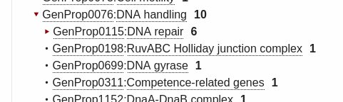

|question| What is the most common class of biosynthetic gene cluster found in this assembly?

The answer is "cf_putative", that information is on the chart and table provided by the MGnify website.

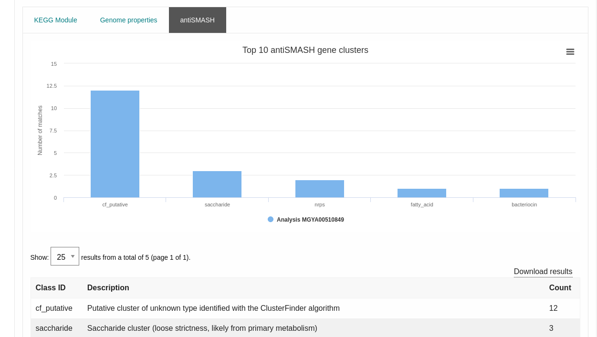

|question| How many non-ribosomal peptide synthetase gene clusters are identified by antiSMASH in this assembly?

There are 12 non-ribosomal peptide synthetase gene clusters (nrps) clusters on this analysis.

|action| Click on the **Contig Viewer** tab. Load the data for the 4th contig in the list by clicking on the contig name (ERZ501066.4-NODE-4-length-276957-cov-33.799655). This contig will now be loaded into the viewer.

|question| How long is this contig? 

Use the "Filter rows" text input to find the contig.

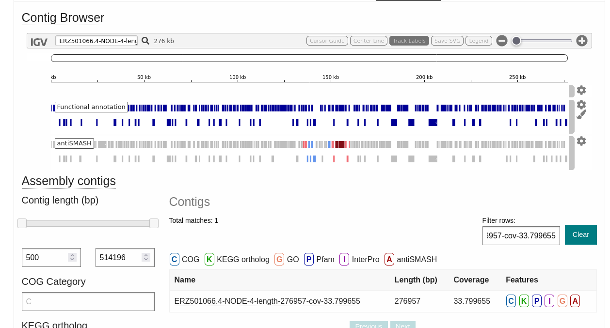

The length of the contig is 276957 bp.

|question| The longest pCDS in the contig appears to start at 202339. What protein is coded for? 

Upon visual inspection we found that the longest pCDS is 202339 bp. Click on the pCDS to get all the annotations for it:

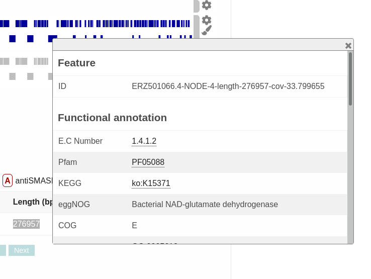

|question| Looking at the antiSMASH annotations, where within the contig do any transport-related genes fall? 

There is a colour coding scheme for the features, to make them visible click on the "Legend" icon on the manu of the contig viewer:

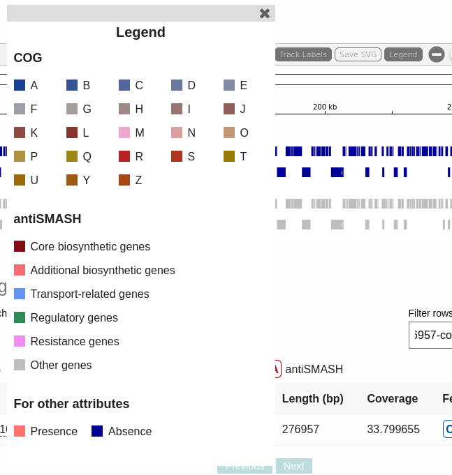

Find the genes that match the colour of the "Transport-related" genes.

|action| Zoom into that region to see the predicted regions in more detail. Have a look at the information about the various transport-related genes. 

|question| What region of the contig is predicted to code for a major facilitator transporter? 

You can click on the pCDS to obtain the starting and ending region for this facilitator transporter.

|info| There are lots of different visualisation options available within the contig viewer. Take some time now to investigate the various options, and play about with it by looking at a few different contigs and the anotations they contain.

MGnify sequence search
**********************

Now we will have a look at the database of proteins identified by MGnify. 

|action| Click on "Sequence search" from the tabs at the top of the page. 

This will open a HMMER search page specific for MGnify. (For more information about the HMMER suite of tools see the HMMER website https://www.ebi.ac.uk/Tools/hmmer/)

|action| Copy and paste the protein sequence below into the sequence search box at the top of the page, and click "submit".

::

GEFWHWTNLLHFILVGLAGGMAFLTALLHLKGHPEARRYTLWALGLIALDLFVLWAESPARFRFTHV
WLFLSFHPTSPIWWGSWGLALSVSAGLLYLGKGPSKPLAWGLLAFSLVALAYPGMALAVNLNRPLWN
ALLAGLFPLTALVLGLGVAVLMKSSWALYPLRILLGASLFLAFLYPFTLTLEARGHLWEEGGVLYGL
FLALGLGAFGKESLAPWAAFLAAAGLRALLVAVGQWQG

|question| How many query results are significant? (i.e. above the red cut-off line)

The cut-off line will be placed on the table, any significant hits will be over this line.

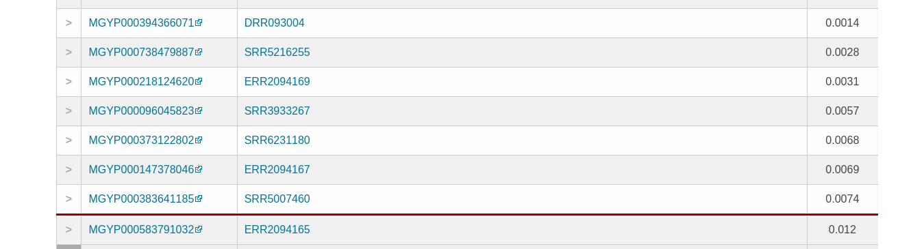

|action| Click on the "Customise" button at the top right of the results table, and select to make "Run and sample IDs" column visible and click "Update". Have a look at the sample data for some of the runs listed in the results (for example the top match result).

|question| We know that the protein belongs to IPR032796 - Polysulfide reductase, we looked for this before hand using InterProScan (https://www.ebi.ac.uk/interpro/search/sequence/). Looking at the samples included in the significant results, does it make sense that the example sequence was from this protein family?.

IPR032796 accession description:
Bacterial polysulfide reductase is an integral membrane protein complex responsible for quinone-coupled reduction of polysulfide, a process important in extreme environments such as deep-sea vents and hot springs. Polysulfides are a class of compounds composed of chains of sulfur atoms, which in their simplest form are present as an anion with general formula Sn(2-). In nature, polysulfides are found in particularly high concentrations in extreme volcanic or geothermically active environments. Here, the reduction and oxidation of polysulfides are vital processes for many bacteria and are essential steps in the global sulfur cycle. In particular, the reduction of polysulfide to hydrogen sulfide in these environments is usually linked to energy-generating respiratory processes, supporting growth of many microorganisms, particularly hyperthermophiles

TODO: WIP.
We can link the function of IPR032796 with the sample if we follow the links between provided in the search results. Let's use this https://www.ebi.ac.uk/metagenomics/runs/SRR5580903 as an eaxmple.

API
***

An `API <https://en.wikipedia.org/wiki/API>`_ ("Application programming interface") is how your scripts (e.g. Python or R) can talk to the MGnify database.

For this section of the practical session we will use a Jupyter Notebook.

.. include:: partials/jupyter.rst

Today's Notebook is "Day 2".

The solutions for this section are embedded in the notebook itself.